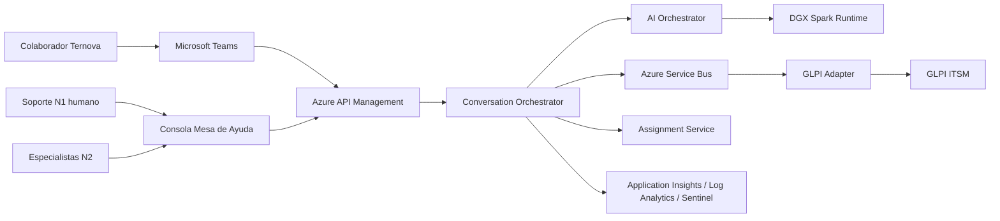
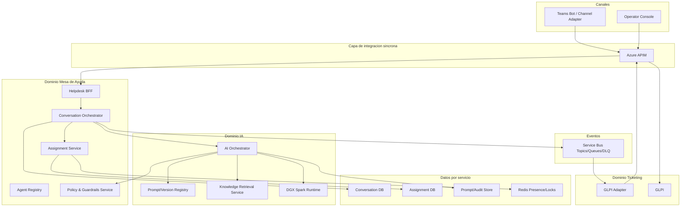
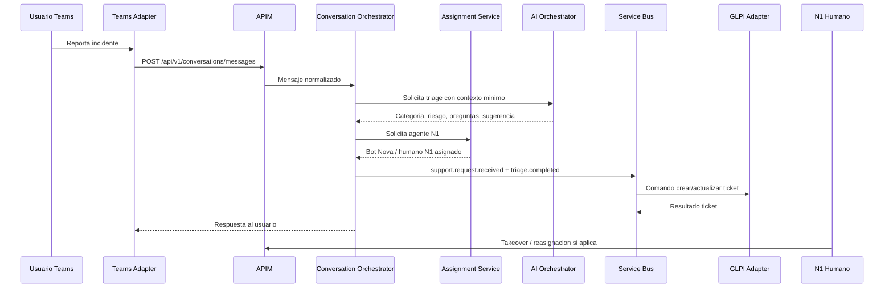

# Mesa de Ayuda Inteligente Ternova - ADD

## 1. Resumen Arquitectonico

La Mesa de Ayuda Inteligente es una plataforma de soporte conversacional para TI que combina Microsoft Teams, un orquestador de conversaciones, un pool mixto de agentes N1 humanos e IA, un runtime DGX Spark como asesor/agente, y GLPI como sistema oficial de tickets.

La arquitectura objetivo cumple la regla de integracion Ternova: comunicacion sincrona por Azure API Management y comunicacion asincrona por Azure Service Bus. No se aprueban integraciones punto a punto entre Teams, GLPI, DGX Spark, Entra ID o servicios internos.

## 2. Drivers y Restricciones

### Drivers de negocio

- Reducir tiempos de espera y clasificacion en soporte TI.
- Asignar casos al tecnico o grupo idoneo, no solo al primero disponible.
- Usar IA como primera linea asistida, sin remover supervision humana.
- Probar tres configuraciones de bot N1 y medir desempeno por categoria.
- Mantener GLPI actualizado como fuente oficial de seguimiento.

### Drivers tecnicos

- API-first y eventos para desacoplar canales, IA, asignacion y ticketing.
- Identidad centralizada en Entra ID.
- Observabilidad end-to-end desde el primer despliegue.
- Auditoria de prompts, tool calls, asignaciones y cambios de estado.
- Database-per-service.

### Restricciones Ternova

- APIs versionadas bajo `/api/v1/`, OAuth2/JWT, OpenAPI y APIM.
- Eventos por Azure Service Bus con Topics, Queues y DLQ.
- Secretos en Azure Key Vault.
- Contenedores publicados en ACR y desplegados por CI/CD.
- Infraestructura por Terraform/Bicep.
- Application Insights, Azure Monitor, Log Analytics y Sentinel.
- Cualquier divergencia requiere waiver formal.

## 3. Vista C4 - Contexto

## 4. Vista de Contenedores

## 5. Componentes

### 5.1 Teams Bot / Channel Adapter

Responsable de recibir y enviar mensajes por Teams. No contiene logica de negocio ni credenciales GLPI. Normaliza mensajes, valida identidad y llama APIs del BFF via APIM.

### 5.2 Operator Console

Interfaz para N1/N2/coordinadores. Permite ver cola, conversaciones, agente actual, recomendaciones IA, ticket GLPI y acciones de reasignacion.

### 5.3 Helpdesk BFF

Backend-for-frontend para consola y Teams. Agrega datos de conversacion, cola, agentes y GLPI sin exponer estructura interna.

### 5.4 Conversation Orchestrator

Servicio principal del dominio. Mantiene estado de conversacion, solicita triage, decide si requiere ticket, publica eventos y coordina handoff.

### 5.5 Assignment Service

Gestiona pool N1 mixto. Considera disponibilidad, capacidad, categoria, riesgo, habilidades, horario y reglas A/B de bots. Debe soportar takeover humano inmediato.

### 5.6 Agent Registry

Catalogo de agentes humanos y bot variants. Versiona configuraciones Nova, Atlas y Cora, sus permisos, categorias habilitadas y limites de riesgo.

### 5.7 AI Orchestrator

Fachada gobernada para DGX Spark o LLM aprobado. Aplica minimizacion de datos, politicas de prompt, redaccion/tokenizacion, versionado y auditoria. No llama GLPI directo.

### 5.8 Policy & Guardrails Service

Evalua clasificacion de datos, riesgo de accion, prompt injection, permisos, reglas de escalamiento y necesidad de aprobacion humana.

### 5.9 Knowledge Retrieval Service

Consulta articulos aprobados de GLPI KB, runbooks y documentos de soporte. Debe conservar linaje de fuente y version.

### 5.10 GLPI Adapter

Unico componente autorizado para traducir comandos internos a llamadas GLPI. Consume eventos/comandos desde Service Bus y expone operaciones gobernadas via APIM. Maneja reintentos, idempotencia y DLQ.

## 6. Flujo Principal

## 7. Modelo de Integracion

### APIs sincronas por APIM

- `Helpdesk BFF API`
- `Conversation API`
- `Assignment API`
- `AI Orchestrator API`
- `GLPI Adapter API`

Todas las APIs:
- Versionadas `/api/v1/`.
- OAuth2/JWT Entra ID.
- Rate limiting.
- OpenAPI.
- Logs JSON con trace ID.
- Mensajes de error seguros.

### Eventos asincronos por Service Bus

Topics propuestos:

- `helpdesk.conversation`
- `helpdesk.assignment`
- `helpdesk.glpi`
- `helpdesk.ai.audit`
- `helpdesk.sla`

Eventos iniciales:

- `support.request.received`
- `conversation.message.created`
- `conversation.triage.completed`
- `assignment.proposed`
- `assignment.changed`
- `ai.response.generated`
- `ai.response.approved`
- `glpi.ticket.create.requested`
- `glpi.ticket.created`
- `glpi.ticket.sync.failed`
- `sla.warning`
- `case.resolved`

Todo topic/queue debe tener DLQ y politicas de reintento.

## 8. Datos

### Database-per-service

- Conversation DB: estado conversacional y metadatos.
- Assignment DB: agentes, capacidades, turnos, reglas.
- Prompt/Audit Store: trazabilidad IA, hashes y metadata.
- Knowledge Index: indices de KB/runbooks aprobados.

No se permite base de datos compartida entre servicios.

### Clasificacion

- Mensajes de usuario: Uso Interno por defecto; pueden elevarse a Confidencial/Restringido si contienen datos personales, credenciales, salud, finanzas, seguridad o informacion estrategica.
- Prompts/respuestas: Uso Interno/Confidencial segun contenido.
- Logs tecnicos: Uso Interno con redaccion de datos sensibles.
- Secretos/tokens: Restringido; nunca en logs.

### Retencion

Pendiente definicion con Datos/Seguridad. Propuesta inicial:
- Conversacion operativa: retencion alineada a GLPI/SLA.
- Prompt audit: metadata y hashes; evitar conservar prompt completo si contiene datos sensibles.
- Adjuntos: solo si son necesarios para soporte y con clasificacion/retencion definida.

## 9. Seguridad

- Entra ID como IdP unico.
- RBAC:
  - Usuario solicitante.
  - Agente N1.
  - Especialista N2.
  - Coordinador.
  - Administrador tecnico.
  - Auditor/Seguridad.
- OAuth2/JWT en APIs.
- Client Credentials para servicios sin UI.
- Secretos en Key Vault.
- TLS 1.2+.
- Private Endpoints cuando aplique.
- WAF/APIM rate limits.
- Filtrado de entrada/salida.
- Auditoria de acciones privilegiadas.
- Acciones sensibles con aprobacion humana y registro.

## 10. Gobierno de IA

Tipo de flujo propuesto TE-005: **Flujo Inteligente** para MVP, porque el agente clasifica, genera respuestas y recomienda rutas, pero el destino y las acciones estan gobernadas por reglas y aprobacion humana. Si se permite que el agente decida autonomamente entre multiples rutas con ejecucion de acciones, la fase futura debe reclasificarse como **Flujo Agentico** y elevar controles/aprobaciones.

Controles obligatorios:

- TDR/Acta de Constitucion antes de desarrollo formal.
- Evaluacion funcional, tecnica y economica.
- Registro de riesgos IA.
- Versionado de prompts y configuraciones Nova/Atlas/Cora.
- Trazabilidad de prompt/tool/result/human approval.
- Evaluacion de sesgo y calidad.
- Monitoreo de costos/uso.
- Registro en Catalogo de Activos IA.
- Transferencia N1/N2.

## 11. Observabilidad

- Trace ID unico desde Teams hasta GLPI.
- Application Insights en todos los servicios.
- Logs estructurados JSON.
- Dashboards por:
  - Cola y SLA.
  - FCR.
  - Precision de triage.
  - Bot variant performance.
  - GLPI sync health.
  - Errores y DLQ.
  - Prompt/audit events.
- Alertas por SLO, no por umbrales arbitrarios.

## 12. Resiliencia

- Si DGX Spark/AI falla: fallback a humano N1 y plantilla de respuesta.
- Si GLPI falla: conservar expediente temporal, reintentar y enviar a DLQ tras politica definida.
- Si Teams falla: operar desde consola y sincronizar cuando canal se recupere.
- Si Assignment Service falla: reglas de asignacion manual por coordinador.
- Rollback documentado por release.

## 13. DevOps e Infraestructura

- Repositorio con `/docs`, `/src`, `/infra`, `/tests`.
- Docker por servicio.
- ACR para imagenes.
- AKS o Azure Container Apps segun carga.
- GitHub Actions/Azure DevOps:
  - lint/test.
  - SAST/dependency scan.
  - build Docker.
  - publish ACR.
  - deploy Dev/QA/Prod con aprobacion Prod.
- IaC Terraform/Bicep.
- Tags Azure obligatorios definidos en PT-ARQ-004.

## 14. Score Inicial de Cumplimiento Arquitectonico

| Dimension | Peso | Score estimado | Comentario |
|---|---:|---:|---|
| Integracion | 25 | 23 | Diseno APIM + Service Bus. Riesgo: prototipo directo a GLPI debe evitarse o documentarse como waiver temporal. |
| Seguridad | 25 | 21 | Entra ID, Key Vault, RBAC, redaccion y auditoria definidos. Falta matriz final de datos/accesos. |
| DevOps | 20 | 17 | Contenedores, CI/CD e IaC definidos. Falta implementacion. |
| Observabilidad | 15 | 13 | Trace ID, App Insights, SLO y dashboards definidos. Falta especificacion fina de metricas. |
| Arquitectura/Datos | 15 | 13 | DDD, database-per-service y gobierno IA definidos. Falta Data Owner/Steward formal. |
| **Total** | **100** | **87** | Aprobable como diseno, pendiente gobierno formal y evidencias. |

## 15. Waivers Potenciales

| ID sugerido | Tipo | Riesgo | Mitigacion |
|---|---|---|---|
| EXC-T-2026-001 | Tecnica | Si el prototipo usa llamada directa controlada a GLPI antes de APIM. | Limitar a Dev, sin datos productivos, token en sidecar/Key Vault, fecha de expiracion <= 90 dias y plan para GLPI Adapter. |
| EXC-T-2026-002 | Tecnica | Si DGX Spark no puede desplegarse inicialmente en AKS/Container Apps. | Exponer solo mediante AI Orchestrator interno, red privada, logs, sin P2P desde canales. |

## 16. Preguntas Abiertas

- Cual sera el alcance exacto de acciones automatizables: solo recomendaciones, o ejecucion de cambios con aprobacion.
- Existe ambiente GLPI QA/sandbox con categorias reales.
- Quiere TI mantener tres bots simultaneos en piloto A/B o rotar por ventanas de tiempo.
- Cuales son los grupos/especialistas iniciales y su matriz de disponibilidad.
- Retencion exacta de conversaciones y prompt audit.
- Si DGX Spark sera runtime productivo o solo laboratorio de evaluacion.

## 17. Checklist PT-ARQ-004

- [x] Integracion por APIM/Service Bus definida.
- [x] APIs versionadas `/api/v1/` y OpenAPI iniciado.
- [x] Docker/ACR/CI-CD/IaC definidos.
- [x] Key Vault, Entra ID, RBAC y Private Endpoints considerados.
- [x] Database-per-service definido.
- [x] Application Insights/Log Analytics/Sentinel definidos.
- [ ] ADD/ADR presentados al Architecture Board.
- [ ] TDR/TE-005 aprobado.
- [ ] Data Owner/Steward asignados.
- [ ] Waivers definidos si el prototipo diverge.
